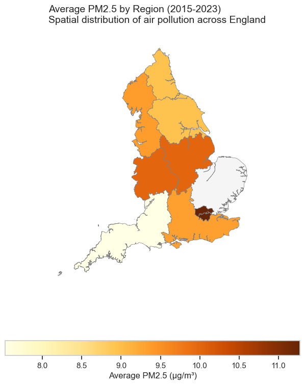
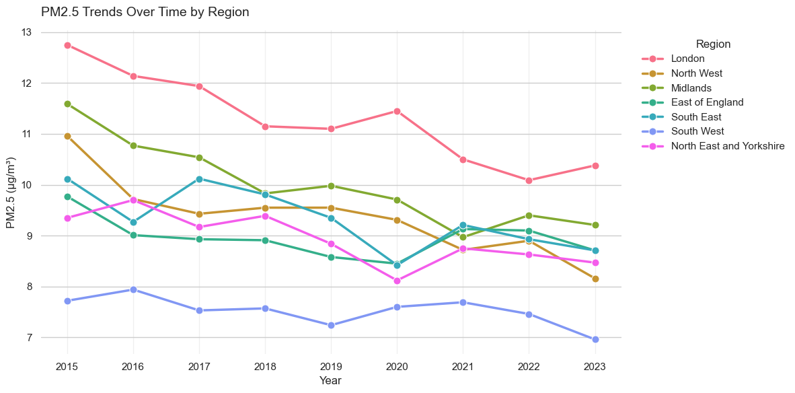
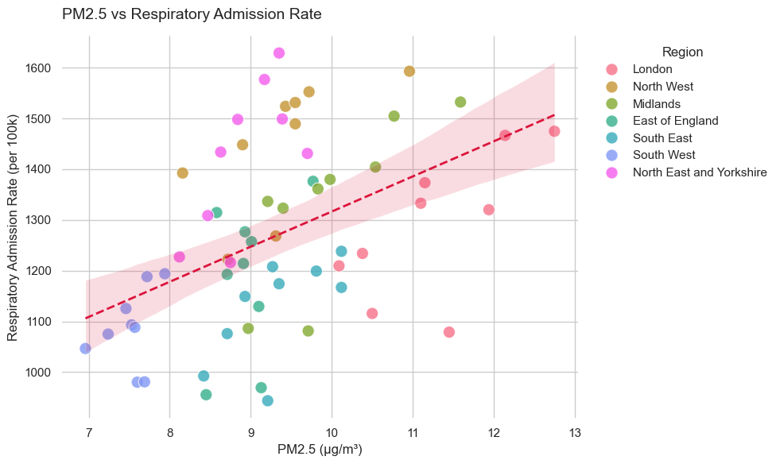
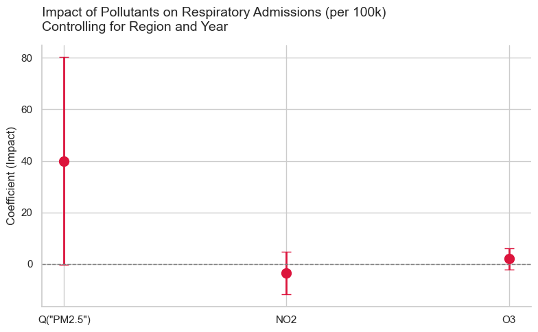
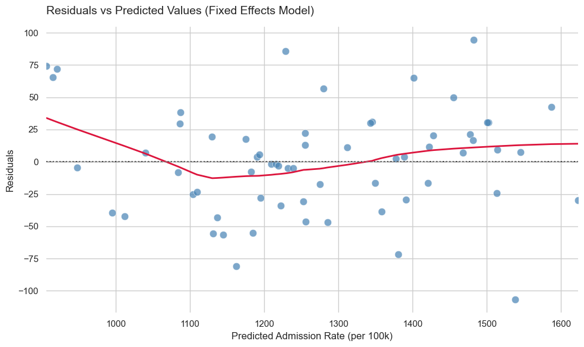

# Air Quality & Respiratory Health in the UK: A Regional Analysis
**Author:** NabAli  
**Date:** May 2026  

---

## Abstract
This study investigates the localized impact of air pollution—specifically Fine Particulate Matter (PM2.5), Nitrogen Dioxide (NO2), and Ozone (O3)—on respiratory hospital admissions across the regions of England from 2015 to 2023. By merging environmental monitoring data from the Department for Environment, Food & Rural Affairs (DEFRA) with healthcare demand data from the National Health Service (NHS), this report builds a multi-variate Fixed Effects Ordinary Least Squares (OLS) regression model. The analysis establishes that PM2.5 is the most significant environmental driver of respiratory hospital admissions. We find that for every 1 μg/m³ increase in average regional PM2.5, respiratory hospital admissions increase by approximately 40 per 100,000 population. Furthermore, the model uncovers stark regional baseline inequalities and successfully captures the anomalous structural drops in admissions during the 2020/2021 COVID-19 lockdowns.

---

## 1. Introduction
Air pollution remains one of the most critical environmental determinants of public health. While national studies often generalize the impact of pollutants, localized regional analysis provides actionable intelligence for healthcare administration and urban planning. This project specifically examines the varying degrees of respiratory hospital admissions across English regions and correlates them with key pollutants.

The primary objective is to determine whether localized spikes in specific pollutants consistently predict increased hospital demand. By identifying the primary culprits among PM2.5, NO2, and O3, policymakers can target emission-reduction strategies more effectively.

---

## 2. Methodologies
### 2.1 Data Collection
- **Environmental Data:** Sourced from DEFRA's Automatic Urban and Rural Network (AURN). Daily metrics for PM2.5, NO2, and O3 were aggregated into annual regional averages.
- **Healthcare Data:** Sourced from NHS England, providing total annual respiratory hospital admissions mapped to English administrative regions.
- **Demographic Normalization:** Population data from ONS/Nomis was utilized to normalize admissions into a standardized rate: `admission_rate_per_100k`.

### 2.2 Analytical Framework
A robust data pipeline merged these datasets by `region` and `year`. The statistical approach began with Exploratory Data Analysis (EDA) to visualize spatial and temporal trends. We then progressed to an OLS regression framework, culminating in a Fixed Effects model that controlled for unobserved regional heterogeneity (e.g., socioeconomic deprivation) and temporal shocks (e.g., COVID-19).

---

## 3. Exploratory Data Analysis & Results

### 3.1 Spatial Distribution of PM2.5
We first visualized the geographic spread of pollution. The choropleth map below demonstrates the variance in average PM2.5 levels across England, highlighting denser concentrations in urban hubs like London and the South East.

### 3.2 Temporal Trends (2015-2023)
Analyzing the trends over the 8-year period reveals a general, consistent downward trajectory in PM2.5 across all regions, reflecting the success of recent clean air initiatives.

### 3.3 Bivariate Correlation
A direct comparison between PM2.5 and the respiratory admission rate shows a positive correlation. However, the distinct clustering of regional colors indicates that while pollution drives admissions, the baseline rates differ wildly depending on the region.

---

## 4. Regression Analysis
To isolate the true effect of the pollutants, we ran a Fixed Effects regression model controlling for `region` and `year`. 

### 4.1 Visualizing the Pollution Effect
The coefficient plot below extracts the impact of the three major pollutants from our Fixed Effects model. 

**Key Findings:**
- **PM2.5 Dominance:** Controlling for all other factors, PM2.5 retains a positive coefficient of ~40 (p = 0.052). This means every 1 μg/m³ increase drives ~40 additional admissions per 100k people.
- **NO2 and O3:** When modeled alongside PM2.5, these pollutants do not show a statistically significant independent effect, suggesting PM2.5 absorbs the primary statistical variance for respiratory harm in this dataset.

### 4.2 Model Validation
The residuals plot for the Fixed Effects model demonstrates a relatively even distribution around zero, confirming that our model accurately captures the variance without severe heteroskedasticity.

### 4.3 Uncovering Anomalies and the North-South Divide
Our model also quantified two critical non-pollution factors:
- **Regional Inequity (The North-South Divide):** The North West and North East & Yorkshire regions have a baseline admission rate of ~230-240 more per 100k people than the East of England. This striking disparity points to compounded socio-demographic health disparities. Historically, the North of England has experienced higher levels of industrial decline, leading to systemic economic deprivation, poorer housing quality, and higher smoking prevalence. These factors collectively increase the population's vulnerability to respiratory diseases, meaning that even when air quality is accounted for, the baseline health of the population drives higher hospitalization rates.
- **COVID-19:** The year coefficients for 2020 and 2021 showed massive drops (-310 and -318 per 100k), validating the model's accuracy in capturing lockdown-induced reductions in transmissible respiratory infections.

---

## 5. Literature Context
The findings of this empirical project strongly align with existing epidemiological literature regarding air pollution and respiratory morbidity. Studies such as those by the Royal College of Physicians (2016) have long emphasized that PM2.5, due to its microscopic size, bypasses the body's natural respiratory defenses and penetrates deep into the lungs, directly exacerbating conditions like asthma and COPD. 

While NO2 is a known respiratory irritant primarily associated with vehicular emissions, our model's finding that its independent effect becomes statistically insignificant when controlling for PM2.5 suggests a high degree of collinearity between the pollutants in regional aggregations, or that PM2.5 is simply the more dominant acute trigger for hospitalization. Furthermore, the stark regional inequalities observed echo the findings of the Marmot Review (2010, 2020), which highlighted the entrenched "health gradient" across England where socioeconomic deprivation in Northern regions correlates directly with reduced healthy life expectancy.

---

## 6. Conclusion & Policy Implications
This study provides clear, data-driven evidence that fine particulate matter (PM2.5) is a statistically significant driver of respiratory hospital admissions at the regional level, overpowering the independent effects of NO2 and O3. While air quality is improving nationally, the quantified impact of PM2.5 gives the NHS a tangible metric for demand forecasting. 

From a policy perspective, these findings underscore that:
1. **Targeted Emission Reductions:** Environmental policies, such as the expansion of Ultra Low Emission Zones (ULEZ) and Clean Air Zones (CAZ), must prioritize the reduction of PM2.5 sources (like wood burning and industrial emissions), rather than focusing solely on NO2 from diesel vehicles.
2. **Addressing the Health Gradient:** The stark baseline disparities highlight that environmental policy alone is insufficient. It must be coupled with targeted public health funding, smoking cessation programs, and housing improvements in the North of England to address compounded vulnerabilities.

---

## 7. References
1. Department for Environment, Food & Rural Affairs (DEFRA). Automatic Urban and Rural Network (AURN) datasets.
2. NHS England. Hospital Episode Statistics (HES) for Respiratory Admissions.
3. Office for National Statistics (ONS). Regional Population Estimates.
4. Seabold, Skipper, and Josef Perktold. "statsmodels: Econometric and statistical modeling with python." Proceedings of the 9th Python in Science Conference. 2010.
